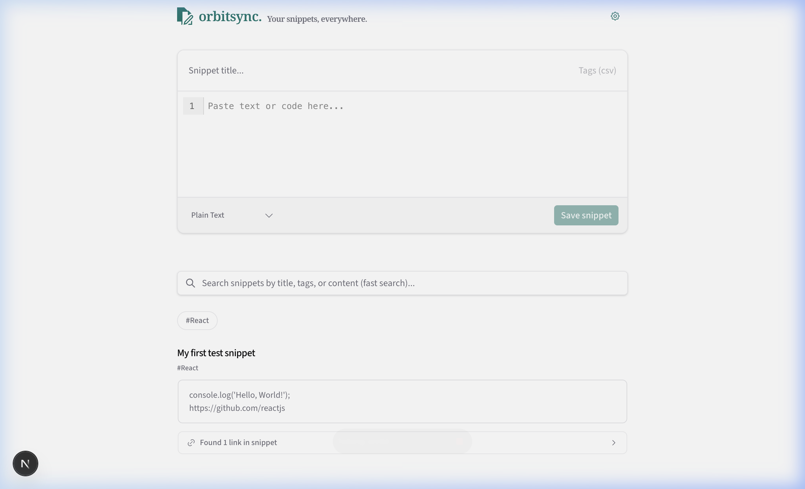

<div align="center">
  
  
  <h1>🪐 Orbitsync</h1>
  <h3>Your snippets, everywhere.</h3>
  
  <p>A modern, fast, and local-first snippet management application built with Next.js.</p>

  <p>
    <a href="#features"><b>Features</b></a> • 
    <a href="#getting-started"><b>Getting Started</b></a> • 
    <a href="#tech-stack"><b>Tech Stack</b></a> • 
    <a href="#self-hosting"><b>Self Hosting</b></a>
  </p>
</div>

---

**Orbitsync** helps you save, search, edit, and organize your code snippets efficiently without any cloud lock-in. Everything is synced seamlessly to your devices via Evolu.

## 🚀 Live Demo

<p align="center">
  
  <br/>
  <em>A real-time subagent recording of snippet creation, syntax highlighting, and dynamic link previews in action.</em>
</p>

## Features

- ⚡️ **Instant Search & Filtering**: Fast client-side searching across snippets by title, content, tags, and language.
- 🏷️ **Dynamic Tagging**: Organize your snippets with custom tags for rapid filtering.
- 💻 **Syntax Highlighting**: Real-time editing and highlighting for multiple languages via CodeMirror.
- 🎨 **Modern Animations**: Provide seamless layout transitions and micro-interactions powered by Motion.
- 🔒 **Local-First Sync**: Built on top of [Evolu](https://evolu.dev) to ensure your data is always available locally first. 

## Getting Started

First, install dependencies:

```bash
npm install
```

Then, run the development server:

```bash
npm run dev
```

Open [http://localhost:3000](http://localhost:3000) with your browser to start building your pocket memory.

## Tech Stack

- **Framework:** [Next.js](https://nextjs.org) (App Router)
- **Database:** [Evolu](https://evolu.dev) (Local-first, CRDTs)
- **Editor:** [CodeMirror](https://codemirror.net/)
- **Animations:** [Motion](https://motion.dev/)
- **UI Components:** [shadcn/ui](https://ui.shadcn.com/)
- **Icons:** [Tabler Icons](https://tabler.io/icons)

## Automated Benchmarks
<!-- BENCHMARK-START -->
| Metric | Status | Time |
|---|---|---|
| **Code Linting** | ✅ Passed | 4s |
| **Unit Tests** | ✅ Passed | 3s |
| **Next.js Build** | ✅ Success | 15s |

<details>
<summary><b>📦 Production Bundle Routes</b></summary>

```text
┌ ○ /
├ ○ /_not-found
├ ƒ /api/link-preview
└ ○ /icon
```
</details>

_Last run on 2026-04-18 19:15:08 UTC for commit `dfc7197`_
<!-- BENCHMARK-END -->

## Self Hosting

You can easily self-host Snipsync on your own server using Docker. This ensures complete privacy and gives you absolute control over your environment. The application is set up for minimal image sizes utilizing Next.js standalone mode.

To build and run the application using `docker-compose`:

1.  Make sure you have Docker and Docker Compose installed.
2.  Clone this repository to your server.
3.  Run the following command at the root of the project:

```bash
docker-compose up -d --build
```

Snipsync will be built inside the container using the lightweight `oven/bun` and `node:alpine` images, and will be running at `http://localhost:3000`. Stop it anytime via `docker-compose down`.
